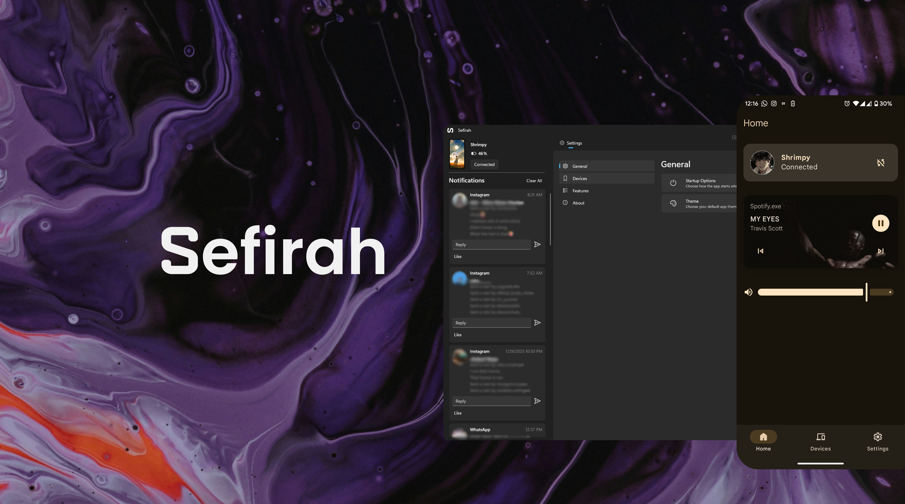

  

# Sefirah - Android

**Sefirah** is an opinionated phone link alternative designed to enhance your workflow with seamless clipboard and notification sharing between your Windows PC and Android device. It's tailored for users who want a straightforward and efficient way to keep their devices in sync.

## Features

- **Clipboard Sync**: Seamlessly share clipboard content between your Android device and Windows PC.
- **Media Control**: Control media playback and the volume of your PC from your Android device.
- **Notification Sync**: Allows to display (or 'toast') notifications from your Android device on your desktop.
- **Storage Integration**: Integrate your Android storage with your PC to access files from your phone.

## Limitations

- **Notification Sync**:
    - Due to Android's restrictions, sensitive notifications are not shown from android 15 onwards.

## How to Use

1. **Download and Install the [Windows app](https://github.com/shrimqy/Sefirah)**

2. **Setting Up**:
    - Allow the necessary permissions on the onboarding page. (**Note:** Only allow restricted settings from App Info after attempting to grant notification access or accessibility permission, as Android blocks side-loaded apps from requesting sensitive permissions.)
    - Ensure both your Android device and Windows PC are connected to the same network.
    - Launch the app on your Windows PC and wait for the devices to show up on both.
    - Initiate the connection on your Android device using either manual connect or auto connect. Manual connect is faster, while auto connect takes a bit more time to determine which IP address works for you.
    - Once the connection is initiated, Windows will receive a pop-up to accept or decline the connection. Ensure that the keys match on both devices.
    - After the authentication is done, you should be navigated to the home screens on both devices, wait a bit for the notifications on Windows to load up for the first time.
3. **Clipboard Sharing**:
    - When you copy content on your desktop, it will automatically sync with your Android device (provided you have enabled this feature in the settings). If you have also enabled image syncing, images should be sent as well. **Note:** You must enable the 'add received images to clipboard' option for image syncing to work.
    - To automatically share the clipboard, enable the corresponding preference in the settings (accessibility permission is required). **Note:** This method may not work in every scenario.
    - To manually share the clipboard, there are two primary methods: using the persistent device status notification or the share sheet.
4. **File Transfer**:
    - Use the share sheet on your Android or Windows device and select the app to share files between the devices.
5. **Windows Explorer Storage**:
   - You would need Android 11 or higher for this to work, I will try to add support for others in a later version.
   - This feature may cause some crashes as this is a bit experimental, but should work stable enough for most cases.

## Screenshots

## Roadmap

- Allow using the device as a webcam 
- Windows widget support
- Calls and SMS features

## Special Thanks
- **Clipboard Detection with Accessibility Service**: [XClipper](https://github.com/KaustubhPatange/XClipper)
- **Sftp Server**: [Kdeconnect-android](https://github.com/KDE/kdeconnect-android)
